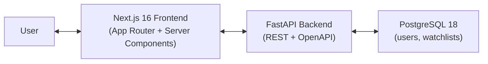
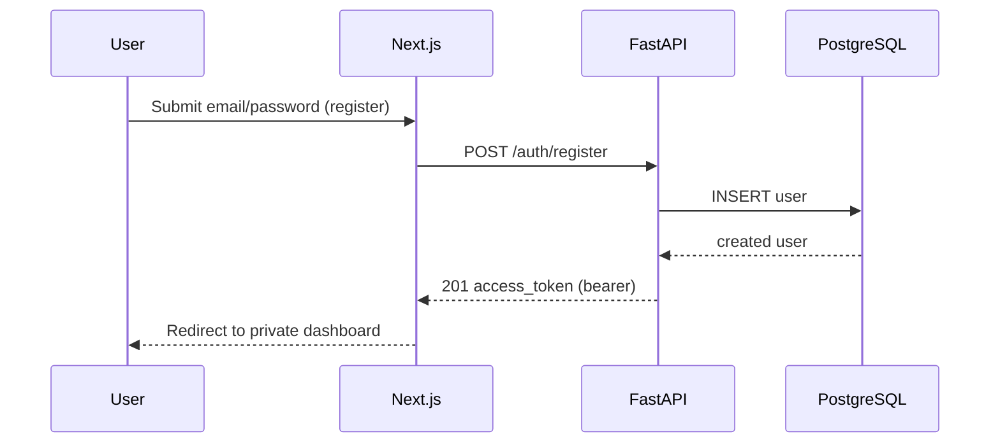
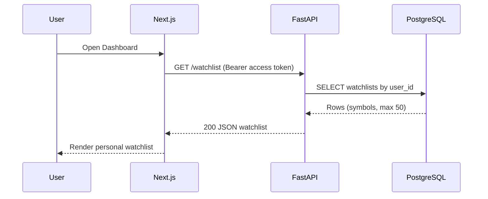
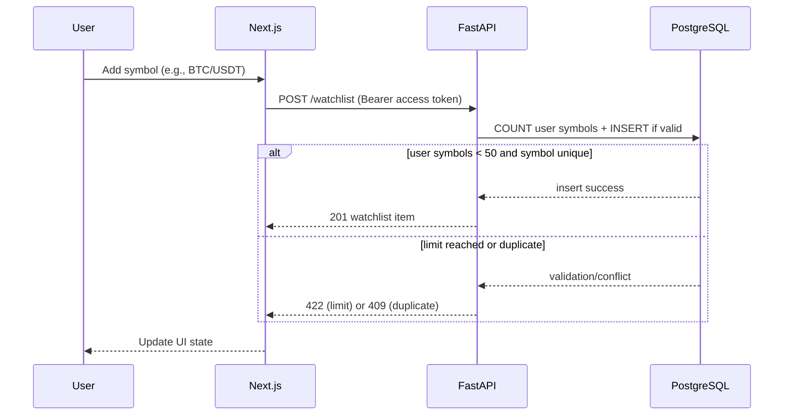

# Crypto Watchlist MVP Architecture

## High-Level Overview
The system is designed as a decoupled full-stack application:
- `frontend` serves UI and authenticated user flows with Next.js 16.
- `backend` exposes REST endpoints via FastAPI.
- `db` stores user accounts and personal watchlists in PostgreSQL 18.

## System Context Diagram

## Auth Flow (Registration With Auto-Login)

## Request Flow (Watchlist Read)

## Request Flow (Watchlist Create With Limit Rule)

## Core Architectural Notes
- Authentication is access-token based in MVP (no refresh-token flow).
- `POST /auth/register` performs automatic login by returning an access token.
- Data isolation is enforced by `user_id` ownership checks on every watchlist operation.
- Business rule: each user can store at most 50 symbols.
- API-first approach is used through versioned OpenAPI contract in `contracts/swagger.json`.